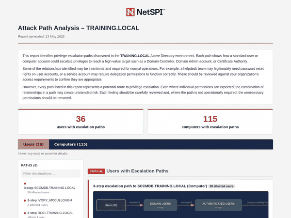
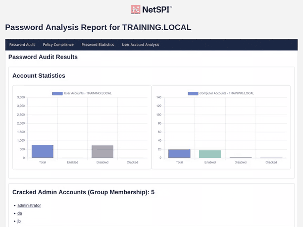

# ADPathfinder

[](https://github.com/NetSPI/AD-PathFinder/actions/workflows/test.yml)

ADPathfinder maps attack paths in Active Directory for pentesters. It pulls BloodHound CE data plus OpenGraph plugins (MSSQLHound and ConfigManBearPig built in) and shows how every user and computer reaches Domain Admins, Domain Controllers, and the rest of Tier 0, across AD, ADCS, SCCM, and MSSQL.

<p align="center">
  
</p>

**Jump to:** [Coverage](#coverage) · [How it works](#how-it-works) · [AD HTML Report](#ad-html-report) · [Password Audit HTML Report](#password-audit-html-report) · [Requirements](#requirements) · [Quickstart](#quickstart) · [Configuration](#configuration) · [Inputs](#inputs) · [Contributors](#contributors)

## Coverage

| Area | Examples |
| --- | --- |
| Core AD | Escalation paths, delegation, admin rights, BadSuccessor, Tier 0 session exposure |
| Passwords | Weak passwords, blank passwords, reuse, username similarity, LM hash use, Kerberoast and AS-REP exposure paired with weak passwords |
| ADCS | ESC-style certificate template and CA risks |
| MSSQL (MSSQLHound, OpenGraph) | Logins, linked servers, impersonation, relay, and privilege escalation paths |
| SCCM (ConfigManBearPig, OpenGraph) | Takeover and relay paths |
| Cross-domain | Trusts, shared passwords, and cross-domain escalation paths |

## How it works

| Stage | What happens |
| --- | --- |
| **Ingest** | BloodHound CE zip plus OpenGraph plugins (MSSQLHound and ConfigManBearPig built in) merged into one graph |
| **Map** | Shortest-path from every user and computer to every high-value target. The edge set is [configurable](https://github.com/NetSPI/AD-PathFinder/wiki/Excluded-Relationships). Drop noisy edges like `HasSession` to see more exploitable routes |
| **Group** | Accounts sharing the same path get grouped, so you get one finding per chokepoint rather than thousands per affected user |
| **Pair** | NTDS dump and hashcat potfile cross-referenced against the graph to flag the chains that are actually walkable today |
| **Layer** | Standalone findings (SMB signing disabled, default privileged groups, etc.) are reported on their own; a higher-severity sibling fires when the same host or group sits on a path to a high-value target |
| **Render** | HTML attack-path report (SVG path graphs, per-edge mitigation, per-step PowerShell validation, mark-remediated tracking), plus text, JSON, and diagnostics outputs |

<p align="center">
  
</p>

## AD HTML Report

<p align="center">
  
</p>

## Password Audit HTML Report

<p align="center">
  
</p>

## Requirements

- Python 3.9 or later.
- BloodHound CE and Neo4j available locally by default at `neo4j://localhost:7687`.
- BloodHound CE API credentials for import and delete operations.
- A BloodHound CE / SharpHound zip for AD audit coverage.
- Optional OpenGraph plugin zips from MSSQLHound and ConfigManBearPig for MSSQL and SCCM coverage.
- Optional NTDS hash dump and hashcat potfile for password-aware audits.

## Quickstart

<details open>
<summary><strong>Install from source</strong></summary>

```bash
git clone https://github.com/NetSPI/AD-PathFinder.git
cd adpathfinder
python3 -m venv .venv
source .venv/bin/activate
pip install -e .
```

</details>

<details>
<summary><strong>Configure BloodHound API access</strong></summary>

```bash
adpathfinder --setup-bloodhound-api
```

This stores the BloodHound CE API settings used for import and delete operations.

</details>

<details>
<summary><strong>Import BloodHound data</strong></summary>

```bash
adpathfinder --import BloodHound.zip
```

Multiple BloodHound and OpenGraph plugin zip files can be imported in one command:

```bash
adpathfinder --import BloodHound.zip MSSQLHound.zip ConfigManBearPig.zip
```

</details>

<details>
<summary><strong>Run a domain audit</strong></summary>

```bash
adpathfinder --ad
```

</details>

<details>
<summary><strong>Run a password-aware audit</strong></summary>

```bash
adpathfinder --ad --pwd Contoso --ntds ntds.txt -p hashcat.potfile
```

Use `--unsafe-report` only when reports should include cleartext passwords.

</details>

<details>
<summary><strong>Write diagnostics</strong></summary>

```bash
adpathfinder --ad --pwd Contoso --ntds ntds.txt -p hashcat.potfile --diagnostics
```

</details>

## Configuration

ADPathfinder reads settings from `config.ini` in the working directory. Each `[NEO4J]` and `[BLOODHOUND]` value can be overridden by an `ADPF_*` environment variable. Run `adpathfinder --setup-bloodhound-api` to populate the BloodHound CE section interactively.

See [Configuration](https://github.com/NetSPI/AD-PathFinder/wiki/Configuration) on the wiki for the full environment-variable list, Neo4j connection schemes (encrypted and self-signed-certificate options), file permissions, and an example `config.ini`. See [Excluded relationships](https://github.com/NetSPI/AD-PathFinder/wiki/Excluded-Relationships) for filtering attack-path output.

## Inputs

| Input | Required | Used for |
| --- | --- | --- |
| BloodHound CE data | Yes for AD audit | Graph relationships, paths, and AD object context |
| Neo4j / BloodHound CE database | Yes | Query backend |
| NTDS hashes | Required for password audit | Password risk and cracked account mapping |
| Hashcat potfile | Required for password audit | Cleartext category analysis and cracked password matching |
| MSSQLHound / ConfigManBearPig / OpenGraph plugin data | Optional | MSSQL and SCCM checks, plus contributor-added platform checks |

Handle NTDS data, potfiles, generated reports, and unsafe report output as sensitive assessment data.

## Contributors

Checks are small classes that register with a decorator, declare their data requirements, and return finding dictionaries. Platform-specific checks gate behind a datasource so normal AD audits skip them when the matching OpenGraph data is not present.

See [Adding new checks](https://github.com/NetSPI/AD-PathFinder/wiki/Adding-New-Checks), [Working with OpenGraph plugins](https://github.com/NetSPI/AD-PathFinder/wiki/OpenGraph-Plugins), and the [Framework Guide](https://github.com/NetSPI/AD-PathFinder/wiki/Framework-Guide) on the wiki.

## Acknowledgements

ADPathfinder builds on data collected by other projects; thanks to their authors and the SpecterOps team:

- [BloodHound CE](https://github.com/SpecterOps/BloodHound) — the Active Directory graph data.
- [MSSQLHound](https://github.com/SpecterOps/MSSQLHound) by Chris Thompson — MSSQL collection.
- [ConfigManBearPig](https://github.com/SpecterOps/ConfigManBearPig) by Chris Thompson — SCCM collection.
