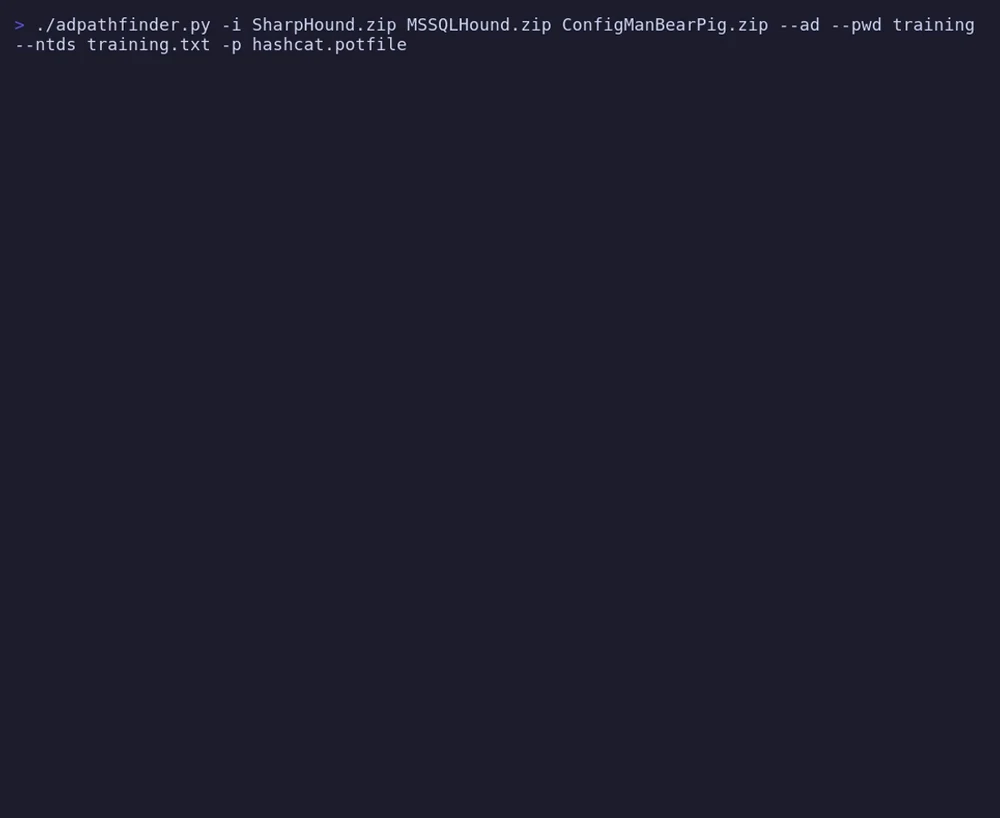
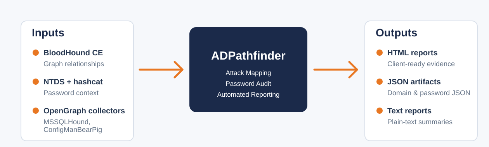
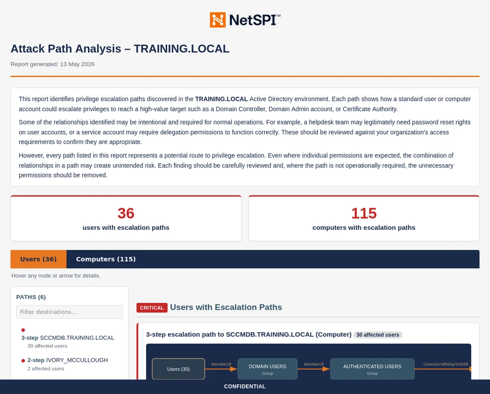
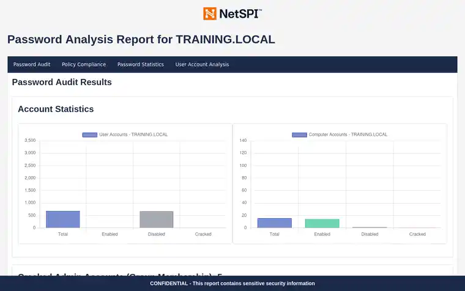

# ADPathfinder

[](https://github.com/NetSPI/AD-PathFinder/actions/workflows/test.yml)

ADPathfinder is an attack mapping tool for pentesters and red teamers. It analyses SharpHound data and unifies it with OpenGraph plugins to surface attack paths to high-value targets such as Domain Admins and Domain Controllers, starting from low-privileged users and computers. MSSQLHound and ConfigManBearPig are supported natively, extending coverage across AD, ADCS, SCCM, and MSSQL.

<p align="center">
  <a href="docs/images/demo-slideshow.mp4">
    
  </a>
</p>

**Jump to:** [Quickstart](#quickstart) · [Coverage](#coverage) · [How it works](#how-it-works) · [Reports](#outputs) · [Configuration](#configuration) · [Contributors](#contributors)

## Coverage

| Area | Examples |
| --- | --- |
| Core AD | Escalation paths, delegation, admin rights, BadSuccessor, exposed high-value sessions |
| Passwords | Weak passwords, blank passwords, reuse, username similarity, LM hash use, Kerberoast and AS-REP exposure paired with weak passwords |
| ADCS | ESC-style certificate template and CA risks |
| MSSQL (MSSQLHound OpenGraph data) | Logins, linked servers, impersonation, relay, and privilege escalation paths |
| SCCM (ConfigManBearPig OpenGraph data) | Takeover and relay paths, PXE-enabled distribution points, and management point policy retrieval |
| Across domains | Trusts, shared passwords, and escalation paths between domains |

## Requirements

- Python 3.9 or later.
- BloodHound CE and Neo4j available locally by default at `neo4j://localhost:7687`.
- BloodHound CE API credentials for import and delete operations.
- A BloodHound CE / SharpHound zip for AD audit coverage.
- Optional OpenGraph plugin zips from MSSQLHound and ConfigManBearPig for MSSQL and SCCM coverage.
- Optional NTDS hash dump and hashcat potfile for password audits.

## Quickstart

<details open>
<summary><strong>Install from source</strong></summary>

```bash
git clone https://github.com/NetSPI/AD-PathFinder.git
cd AD-PathFinder
python3 -m venv .venv
source .venv/bin/activate
pip install -e .
```

</details>

<details>
<summary><strong>Configure BloodHound API access</strong></summary>

```bash
adpathfinder --setup-bloodhound-api
```

This stores the BloodHound CE API settings used for import and delete operations.

</details>

<details>
<summary><strong>Import SharpHound data</strong></summary>

```bash
adpathfinder --import SharpHound.zip
```

Multiple SharpHound and OpenGraph plugin zip files can be imported in one command:

```bash
adpathfinder --import SharpHound.zip MSSQLHound.zip ConfigManBearPig.zip
```

</details>

<details>
<summary><strong>Import data and run a full audit</strong></summary>

```bash
adpathfinder -i SharpHound.zip MSSQLHound.zip ConfigManBearPig.zip --ad --pwd Contoso,ContosoIT --ntds ntds.txt -p hashcat.potfile
```

Use only the zip files you have. The `--pwd` value is not the AD domain; it is a comma separated list of company, brand, or organisation terms to flag in cracked passwords.

</details>

<details>
<summary><strong>Run a domain audit</strong></summary>

```bash
adpathfinder --ad
```

</details>

<details>
<summary><strong>Run a password audit</strong></summary>

```bash
adpathfinder --ad --pwd Contoso,ContosoIT --ntds ntds.txt -p hashcat.potfile
```

Use `--unsafe-report` only when reports should include cleartext passwords.

</details>

<details>
<summary><strong>Write diagnostics</strong></summary>

```bash
adpathfinder --ad --pwd Contoso,ContosoIT --ntds ntds.txt -p hashcat.potfile --diagnostics
```

</details>

## How it works

| Stage | What happens |
| --- | --- |
| **Ingest** | Merges SharpHound and supported OpenGraph zips into one graph. MSSQLHound and ConfigManBearPig data are supported directly |
| **Map** | Finds the shortest paths from users and computers to high-value targets. You can [configure the edge set](https://github.com/NetSPI/AD-PathFinder/wiki/Excluded-Relationships) to remove noisy edges like `HasSession` |
| **Group** | Groups accounts that share a path, so repeated paths are reported as one finding instead of many near-duplicates |
| **Pair** | Compares NTDS hashes and hashcat potfiles with graph data to show which paths are usable during the assessment |
| **Layer** | Reports standalone findings such as SMB signing disabled or default privileged groups, and raises the severity when the same host or group also sits on a path to high-value targets |
| **Render** | Writes HTML reports with SVG path graphs, mitigation notes, PowerShell validation steps, and remediated state tracking, plus text, JSON, and diagnostics outputs |

<p align="center">
  
</p>

## AD HTML Report

<p align="center">
  <a href="docs/images/ad-report-slideshow.mp4">
    
  </a>
</p>

## Password Audit HTML Report

<p align="center">
  <a href="docs/images/password-audit-slideshow.mp4">
    
  </a>
</p>

## Configuration

ADPathfinder reads `config.ini` from the working directory. Values can also be set with `ADPF_*` environment variables.

Run this to configure BloodHound CE API access for imports and deletes:

```bash
adpathfinder --setup-bloodhound-api
```

See [Configuration](https://github.com/NetSPI/AD-PathFinder/wiki/Configuration) on the wiki for all options, Neo4j connection settings, file permissions, and example configs. See [Excluded relationships](https://github.com/NetSPI/AD-PathFinder/wiki/Excluded-Relationships) for filtering attack path output.

## Outputs

Reports are written to `report_<domain>/`, for example `report_training.local/`.

| Output | Purpose |
| --- | --- |
| `<domain>_AD_report.html` | HTML report for clients with grouped findings, path graphs, mitigation notes, validation steps, and remediated state tracking |
| `<domain>_domain_audit.txt` / `<domain>_domain_audit.json` | Text and JSON domain audit outputs for review, automation, and later analysis |
| `<domain>_password_audit.html` / `<domain>_password_audit.txt` / `<domain>_password_audit.json` | Password audit outputs when NTDS hashes and a hashcat potfile are provided |
| `<domain>_*_unsafe.*` | Optional unsafe reports generated only with `--unsafe-report`; these may include cleartext passwords |
| `diagnostics.json` | Optional run statistics and debugging data generated with `--diagnostics` |

Handle NTDS data, potfiles, and generated reports as sensitive assessment data. The `--unsafe-report` flag writes cleartext passwords into the output files; only use it when you specifically need cleartext in the report, and store the resulting `_unsafe` files accordingly.

See [`sample_reports/`](sample_reports/) for example domain audit and password audit output.

## Contributors

Checks are small classes that register with a decorator, declare their data requirements, and return finding dictionaries. Platform checks declare their datasource, so normal AD audits skip MSSQL or SCCM checks when the matching OpenGraph data is not present.

See [Adding new checks](https://github.com/NetSPI/AD-PathFinder/wiki/Adding-New-Checks), [Working with OpenGraph plugins](docs/OPENGRAPH.md), and the [Framework Guide](https://github.com/NetSPI/AD-PathFinder/wiki/Framework-Guide) on the wiki.

### Testing

`pip install -e ".[test]"` then `pytest tests/ -m "not neo4j and not integration"` runs the fast framework tests without Neo4j. See [`tests/README.md`](tests/README.md) for the Neo4j fixture suite and the full local test workflow.

## Acknowledgements

ADPathfinder builds on data collected by other projects; thanks to their authors and the SpecterOps team:

- [BloodHound CE](https://github.com/SpecterOps/BloodHound) — the Active Directory graph data.
- [MSSQLHound](https://github.com/SpecterOps/MSSQLHound) by Chris Thompson — MSSQL collection.
- [ConfigManBearPig](https://github.com/SpecterOps/ConfigManBearPig) by Chris Thompson — SCCM collection.
